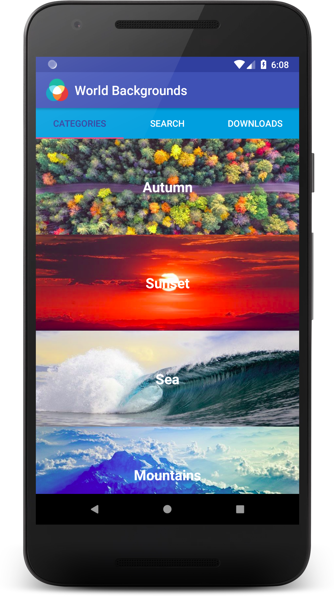
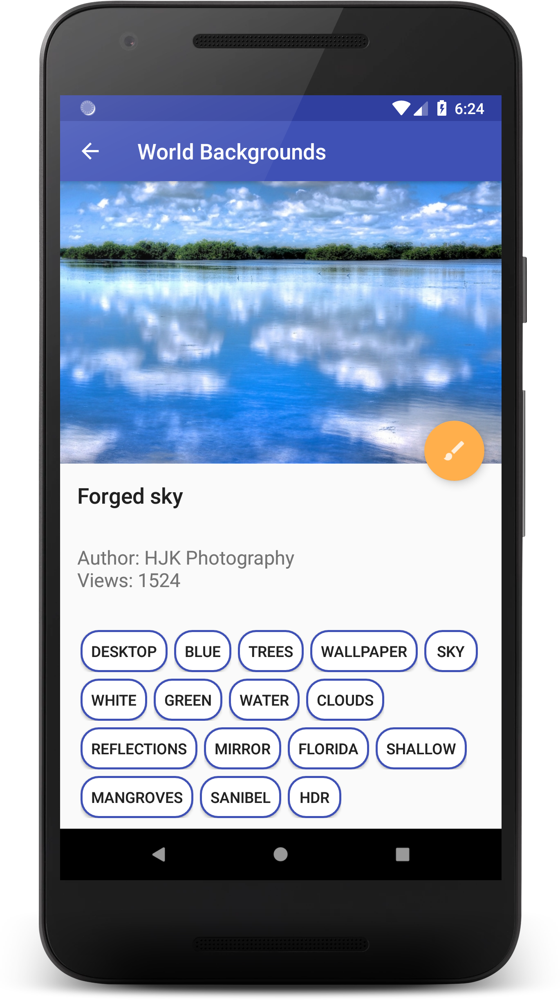
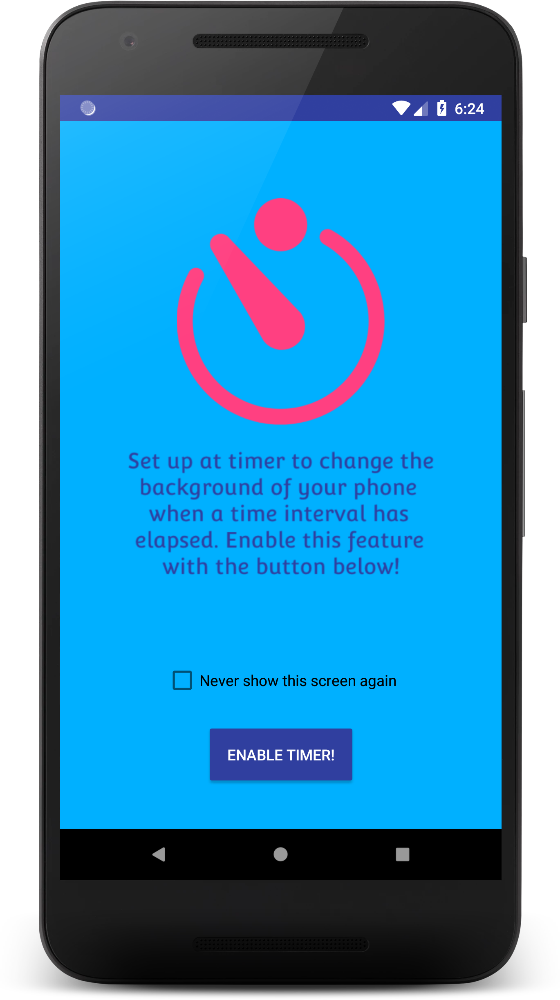
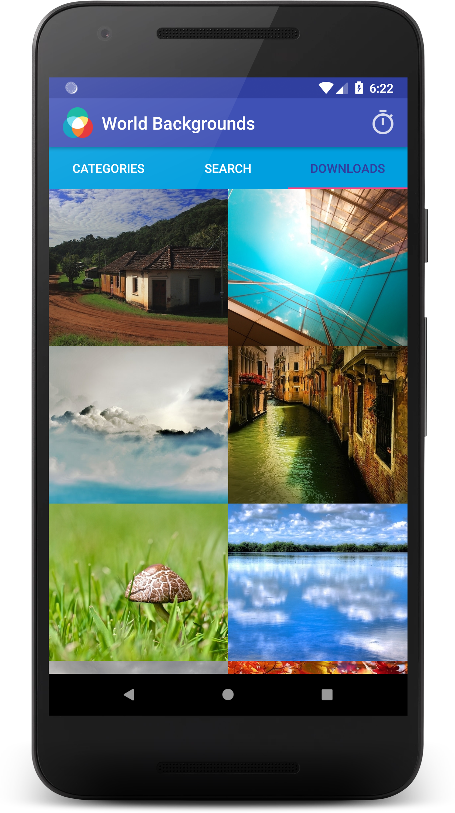
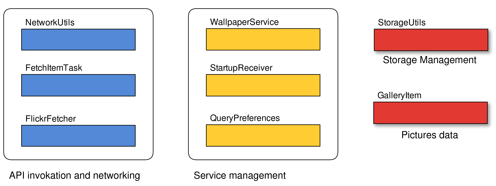

World Background Application
==========================================

World Background is an Android application whose aim is to let users
browse and download pictures to be set as wallpapers and lockscreen of
their devices. Pictures are taken from the famous image and video
hosting service Flickr which offers a rich set of APIs for free. To make
sure that all pictures are suitable to be set as wallpapers the
application actually only shows those that belong to the public group
“Wallpapers and Backgrounds”. Such group hosts more than fifty thousand
pictures uploaded by almost 6 thousand people. The main screen of the
application shows a scrollable list of the most recent pictures uploaded
to the Flickr group. Swiping left or right brings up new screens which
respectively display a list of categories to group pictures according to
their subject and a list pictures that have been downloaded by the user.
This last screen also introduces a new functionality which is accessible
by clicking on the timer icon displayed in the upright corner. The user
can set a timer that triggers after a user specified amount of time has
elapsed. Each time the timer fires, a new picture, randomly chosen among
the ones the user has downloaded, is selected to be set as wallpaper and
lockscreen. To facilitate picture browsing the application leverages
tags. Tags are strings attached to each pictures provided either by
Flickr or by the photographer himself to describe the content of the
picture. From the main screen the user is offered the possibility to
input a string and search pictures tagged with that string or keyword.
When a picture is selected the application shows a new screen that
displays a bigger version of the picture, picture’s title, number of
views, photographer’s name, a floating action button to download the
picture or set it as background and a list of clickable tags associated
with the selected pictures. Each tag button, if pressed, will bring up a
new list of pictures with that tag in common.The following screenshots
quickly summarize the functionalities described above...

<table> 
  <tr> 
    <td></td>
    <td></td>
  </tr>
  <tr>
    <td></td>
    <td></td>
  </tr>
</table>

In the following section I am going to described the high level
architecture I chose to implement this application and the stack of
activity that gets generated during its usage. I will provide two graphs
that summarizes the application screen flow and group all classes, that
do not extend Activity or Fragment, based on their functionalities.

Overall architecture graphs
===========================

In this section I provide a view of the application through graphs.

Application screen flow
-----------------------

The first graph refers to the application screen flow. All nodes of the
graph are classes that extends Activity or Fragment. Consequently they
all provide a view that is shown to the user. Connection between
different nodes of the graph represent a possible screen flow of the
application that the user may or may not choose. The block filled with
blue represent the main Activity of the application. It posses an
instance of ViewPager and an array of three different Fragments that the
user can visualize by swiping left or right. The main Fragment is
WorldBackground which shows a list of the most recent pictures uploaded
to Flickr (Figure 1, page ). The left Fragment is CategoryFragment
(Figure 2, page ). It groups pictures based on their subject and
provides to the user a set of categories to choose from. The right
Fragment is DownloadFragment and lists user downloaded pictures. From
CategoryFragment and WorldBackgorundFragment the user can fire an
instance of TaggedPicturesActivity by either selecting a category or
looking for pictures with a keyword using the SearchView inside
MainPagerActivity. Selecting a pictures from WorldBackgorundFragment or
TaggedPicturesActivity instanciate a new object of the type
DetailImageActivity (Figure 3, page ). Pressing a tag associated to a
picture inside DetailImageActivity again opens an instance of
TaggedPicturesActivity. FullscreenImageActivity displays the original
version of a picture (not its thumbnail) and it can be instanciated from
DownloadFragment or DetailImageActivity only if the picture has been
previously downloaded. TimerExplanationActivity (Figure 4, page ) only
fires if the user access the timer functionality and can be disabled at
any time.

Network and storage management
------------------------------

The graph the I provide in this section summarizes and groups all those
classes that do not extend Activity or Fragment and that do no provide a
view to be shown to the users. Classes are grouped based on their
functionalities and many of the application’s Activities or Fragments
leverage their services to build the views they display. Many times such
services and functionalities are implemented as routines that run in a
background thread.

The first group of these classes deals with network management and API
invocation. The classes inside this group communicate with Flickr
servers, parse their answer and provide a set of GalleryItem object to
be displayed.

The second set of classes deal with the management of the wallpaper
service: the functionality that allow users set a timer to automatically
change the wallpaper of their devices. These classes register a new
service to the operative system and randomly pick a picture to be set as
wallpaper when the timer elapses.

StorageUtils and GalleryItem respectively include all functions
necessary to manage the storage and the folders that the app creates
inside of it, and all fields necessary for a picture to be shown by
classes that provide views.

In the next section I am going to the describe more in depth how all
these classes work and what is their role inside World Background
application.

High Level Application Architecture
===================================

MainPagerActivity
-----------------

The main activity of World Wallpaper is **MainPagerActivity** which
inherits from AppCompatActivity. This activity is in charge of showing
the very first screen that the user sees. The main components of this
activity is an object of the class ViewPager. This object manages three
fragments that are **WorldBackgroundFragment**, **DownloadFragment**,
**CategoryFragment**. The first is in charge of creating the scrollable
view that displays the list of recent pictures. DownloadFragment
displays the list of downloaded pictures and CategroyFragment displays
the list of categories that group pictures based on their content. Since
these fragments are managed by a ViewPager, swiping left or right will
make the ViewPager object retrieve a new Fragment to show its view.

DownloadFragment gets all pictures that the user have downloaded and
display them in a list. Every time a user download a picture two version
of it get downloaded and stored in two different folders inside the app
private storage: /thumbnails and /pictures. The first folder contains a
small version of the original picture while the second stores the
original file. All functions that manage storage are grouped inside the
StorageUtils class.

FullscreenImageActivity
-----------------------

The activity **FullscreenImageActivity** is in charge of showing to user
a picture, that has already been downloaded, fullscreen. It is launched
when the user selects an item inside the list shown by DownloadFragment.

TaggedPictureActivity and DetailImageActivity stack
---------------------------------------------------

The activity TaggedPicturesActivity and DetailImageActivity implement
the mechanism through which the user is allowed to browse Flickr images.
**TaggedPicturesActivity** displays in a RecyclerVier a list of pictures
that have in common a particular tag. **DetailImageActivity** gets
executed when a user select the thumbnail of a new pictures. It shows a
bigger version of such picture, its name, author, views and a list of
tags inside buttons. Pressing one of this button again launches another
instance of TaggedPicturesActivity. This mechanism generates a stack of
TaggedPicturesActivity interwound with DetailImageActivity. This stack
can freely grow until the operative system deallocate from memory
activities to save memory. In any moment the user is allowed to navigate
up inside the stack using a navigation up arrow provided on both
DetailImageActivity and TaggedImageActivity. This action allows the user
to pop one activity off the stack.

MainPagerActivity offers the user different ways to browse pictures
that, at the end, always end up in the stack of activities described
above. Selecting a category from CategoryFragment or looking for
pictures from WorldBackgroundFragment using its SearchView starts an
instance of TaggedPicturesAcrivity. Selecting a pictures from the list
of recently uploaded pictures fires an instance of DetailImageActivity.

Wallpaper Service Management
----------------------------

The classes **WallpaperService**, **StartupReceiver**,
**TimerExplanationActivity** and **QueryPreferences** implement the
function that allows to automatically change the background image after
a given amount of timer chosen by the user has elapsed.

**QueryPreferences** is an helper class whose aim is to ease access to
data saved in a file inside the application’s storage through the
interface SharedPreferences provided by the android SDK. The information
stored in such file are the following: whether the timer is set,
duration of timer, whether it is necessary to show the one time screen
to inform the user about timer functionality.

When accessing such function from DownloadFragmenter,
**TimerExplanationActivity** may or may not get executed based on the
content of the SharedPrefrence file. If executes, it shows informations
about the functionality the user is going to access. It also provide a
checkbox the lets the user disable such an activity in all future
accesses by exploiting functions provided in QueryPreferences.

**WallpaperService** is the class that actually creates a new pending
intent for a new service and passes it to the operative system or delete
a pending intent previously delivered to Android.

The last class mentioned above is **StartupReceiver**. This class
extends BroadcastRecevier and it waits to receive the broadcast intent
ONBOOTCOMPLETED. If it receives such an intent after the device has been
powered up it calls functions implemented in WallpaperService to check
whether it is necessary to restore a service active before the device
was powered down. Information on whether this is necessary or not is
retrieved by WallpeperService class exploiting the functions provided by
QueryPreferences.

Network Management and Flickr APIs
----------------------------------

The classes FetchItemTask and FlickrFetcher deal with the communication
with Flickr servers and invoke their APIs.

**FetchItemTask** extends the class AsyncTask&lt;Void, Void, Void&gt;
and it executes one task in a background thread to avoid blocking the UI
which runs on the main thread. Based on the parameters it receives it
executes different functions implemented inside FlickrFetcher that
invoke the Flickr APIs. All such functions run inside a background
thread.

**FlickrFetcher** is the class where all methods used to invoke Flickr
APIs and to parse the JSON answers received from servers are
implemented. Flickr APIs are run by opening an HTTP connection to a
specific IP address. The path inside the remote machines determines
which APIs will be executed. The answer is provided in JSON format and
it includes all information about a hundred pictures and the URLs that
allow you to download them. Another function inside FlickFetcher parses
the JSON file received by the application and initializes objects of the
class GalleryItem. Each object of the class gallery item includes all
information read from the JSON file about a single pictures. All
activities that display pictures to the user posses and ArrayList of
such objects whose content will be displayed inside the class’
RecyclerView.

Storage Management
------------------

Last but no least, the class **StorageUtils** is an helper class the
manages the application storage. It provides functions to save, delete
and retrieve thumbnails and original pictures from the folders
/thumbnails and /pictures inside the application private storage. Its
functionalities are exploited by classes like DetailImageActivity,
WallpaperService and DownloadFragmnent. In particular
DetailImageActivity is the class that manages a floating action button
to allow the user to download a picture and set it as wallpaper.

Conclusions
===========

Concluding I can say that the application has achieved its basic
functionalities and also its look and feel can be considered satisfying.
Nonetheless improvements and further works may be useful to get it
better. It would be good to be able to leverage the rich Flickr APIs to
log in the user inside the application and let him also upload pictures
he has taken. New search methods could be introduced like searching for
pictures taken in physical position close to where the current picture
has been taken.
